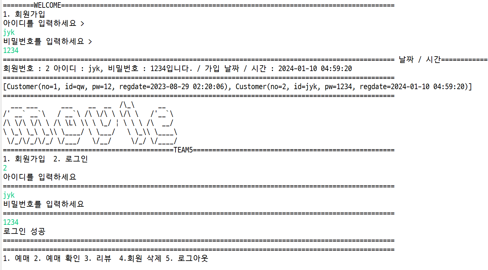
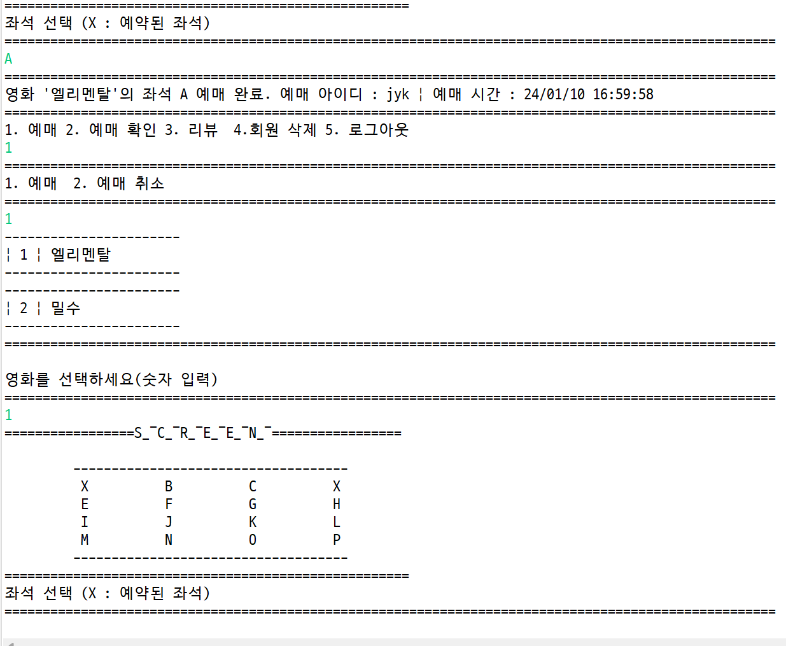
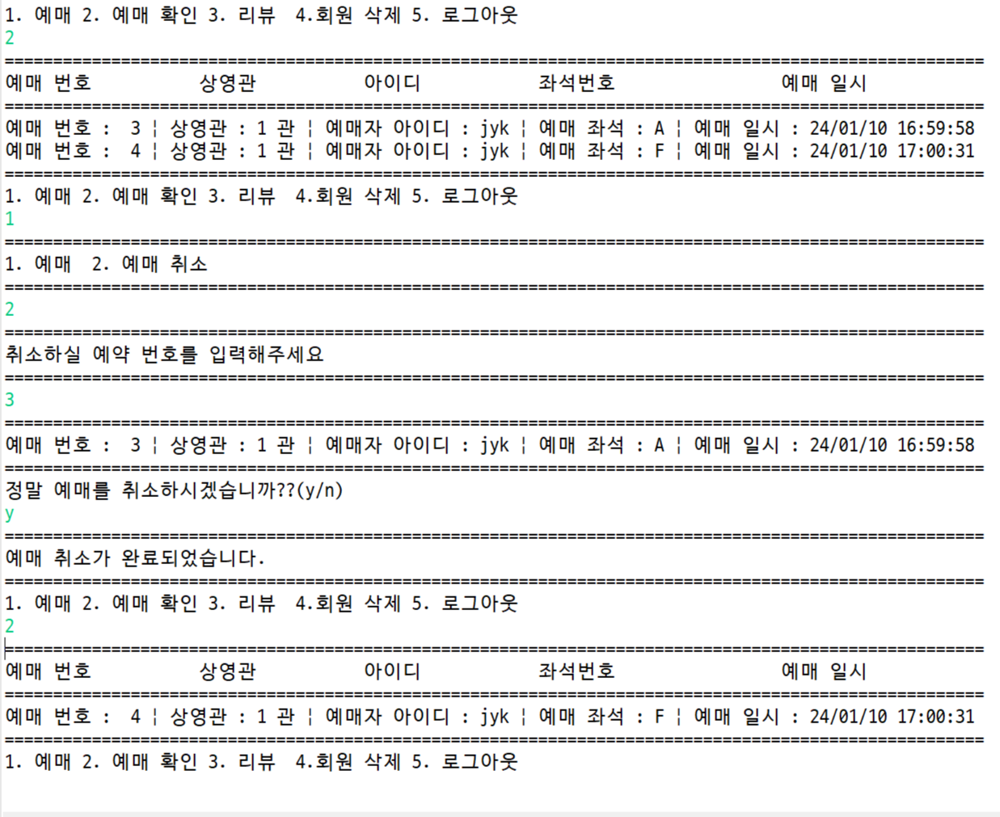

# Movie Reservation with JAVA (without UI)

- 회원 관리
- 영화 예약
- 영화 리뷰

# Package

- Main
- Service
- Util
- Vo

# etc

- singleton

  - 싱글톤 패턴은 특정 클래스의 인스턴스를 1개만 생성되는 것을 보장하는 디자인 패턴. 즉, 생성자를 통해서 여러 번 호출이 되더라도 인스턴스를 새로 생성하지 않고 최초 호출 시에 만들어두었던 인스턴스를 재활용하는 패턴

  - 싱글톤 패턴을 사용함으로써 얻을 수 있는 이점 중 하나는 메모리 낭비를 방지할 수 있음

  - 의존성이 높아진다.
    싱글톤 패턴을 사용하는 경우 클래스의 객체를 미리 생성한 뒤에 필요한 경우 정적 메서드를 이용하기 대문에 클래스 사이에 의존성이 높아지게 된다는 문제점이 있음. (= 높은 결합)

    싱글톤의 인스턴스가 변경 되면 해당 인스턴스를 참조하는 모든 클래스들을 수정해야 하는 문제가 발생.

  - private 생성자 때문에 상속이 어려움.
    싱글톤 패턴은 기본 생성자를 private로 만들었기 때문에 상속을 통한 자식 클래스를 만들 수 없다는 문제점이 있음. 즉, 자바의 객체지향 언어의 장점 중 하나인 다형성을 적용하지 못한다는 문제로 이어짐.

# 회원 가입

# 영화 예매

# 예매 취소

